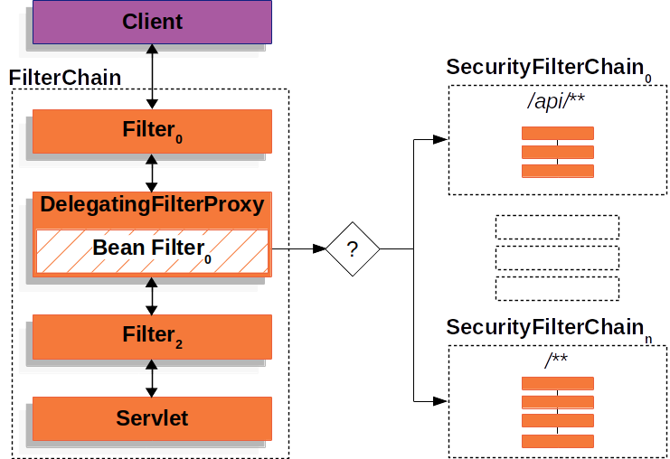

#### Spring Security 架构

##### Filter 过滤器回顾

Spring Security 对 Servlet 的支持基于 Servlet 过滤器，因此通常首先了解过滤器的作用会很有帮助。


客户端向应用程序发送了一个请求，容器创建了一个FilterChain，其中包含了过滤器和Servlet，它们应该根据请求URI的路径来处理HttpServletRequest。在Spring MVC应用程序中，Servlet是DispatcherServlet的一个实例。一个Servlet最多可以处理一个HttpServletRequest和HttpServletResponse。然而，可以使用多个Filter来：

  - 防止下游的Filter或Servlet被调用。在这种情况下，Filter通常会写入HttpServletResponse
  - 修改下游的Filter和Servlet所使用的HttpServletRequest或HttpServletResponse

```java
public void doFilter(ServletRequest request, ServletResponse response, FilterChain chain) {
	// do something before the rest of the application
    chain.doFilter(request, response); // invoke the rest of the application
    // do something after the rest of the application
}
```

由于一个Filter只影响下游的Filter和Servlet，所以每个Filter的调用顺序是非常重要的。

---

##### DelegatingFilterProxy 委托过滤代理

Spring提供了一个名为DelegatingFilterProxy的Filter实现，允许在Servlet容器的生命周期和Spring的ApplicationContext之间建立桥梁。Servlet容器允许使用自己的标准来注册过滤器，但它不知道Spring定义的Bean。DelegatingFilterProxy可以通过标准的Servlet容器机制来注册，但将所有工作委托给实现Filter的Spring Bean。

下面是DelegatingFilterProxy如何融入Filter和FilterChain的示例。


DelegatingFilterProxy从ApplicationContext中查找Bean Filter0，然后调用Bean Filter0。

DelegatingFilterProxy的另一个好处是，它允许延迟查找Filter Bean实例。这一点很重要，因为容器需要在容器启动之前注册Filter实例。然而，Spring通常使用ContextLoaderListener来加载Spring Bean，直到需要注册Filter实例之后Spring才会完成。

---

##### FilterChainProxy 过滤器链代理

Spring Security的Servlet支持包含在FilterChainProxy中。FilterChainProxy是由Spring Security提供的一个特殊的Filter，它允许通过SecurityFilterChain委托许多Filter实例。由于FilterChainProxy是一个Bean，它通常被包装在DelegatingFilterProxy中。


---

##### SecurityFilterChain

SecurityFilterChain由FilterChainProxy使用，以确定该请求应调用哪些SpringSecurity过滤器。


SecurityFilterChain中的Security Filters通常是Bean，但它们是通过FilterChainProxy而不是DelegatingFilterProxy注册的。与直接向Servlet容器或DelegatingFilterProxy注册相比，FilterChainProxy有很多优点。首先，它为Spring Security的所有Servlet支持提供了一个起点。出于这个原因，如果你试图对Spring Security的Servlet支持进行故障诊断，在FilterChainProxy中添加一个调试点是一个很好的开始。

其次，由于FilterChainProxy是Spring Security使用的核心，它可以执行一些不被视为可选的任务。例如，它清除了SecurityContext以避免内存泄漏。它还应用Spring Security的HttpFirewall来保护应用程序免受某些类型的攻击。

此外，它在确定何时应该调用SecurityFilterChain方面提供了更多的灵活性。在Servlet容器中，过滤器的调用仅基于URL。然而，FilterChainProxy可以通过利用RequestMatcher接口，根据HttpServletRequest中的任何内容确定调用。



在多安全过滤链图中，FilterChainProxy决定应该使用哪个安全过滤链。只有第一个匹配的SecurityFilterChain 0才会被调用。假设没有其他的SecurityFilterChain实例与之匹配，就会调用SecurityFilterChain n。

---

##### SecurityFilter

SecurityFilter是通过SecurityFilterChain API插入FilterChainProxy中的。过滤器的顺序很重要。通常没有必要知道Spring Security的过滤器的顺序。然而，有时了解其顺序是有好处的

- ChannelProcessingFilter：确保请求投递到要求渠道。最常见的使用场景就是指定哪些请求必须使用 HTTPS 协议，哪些请求必须使用 HTTP 协议，哪些请求随便使用哪种协议均可。
- ConcurrentSessionFilter
- WebAsyncManagerIntegrationFilter：集成SecurityContext到 Spring Web 异步请求机制中的WebAsyncManager
- SecurityContextPersistenceFilter：每次请求处理之前，从 Session（默认使用HttpSessionSecurityContextRepository）中获取SecurityContext，然后将其设置给到SecurityContextHolder；在请求结束后，就会将SecurityContextHolder中存储的SecurityContext重新保存到 Session 中，并且清除SecurityContextHolder中的SecurityContext。
- HeaderWriterFilter：该过滤器可为响应添加一些响应头，比如添加X-Frame-Options，X-XSS-Protection和X-Content-Type-Options等响应头，让浏览器开启保护功能。
- CorsFilter：理跨域资源共享(CORS)。可以通过HttpSecurity#cors()来定制
- CsrfFilter：处理跨站请求伪造(CSRF)。可以通过HttpSecurity#csrf()来开启或关闭。在前后端分离项目中，不需要使用 CSRF。
- LogoutFilter：处理退出登录请求。可以通过HttpSecurity#logout()来定制退出逻辑
- OAuth2AuthorizationRequestRedirectFilter：用于构建 OAuth 2.0 认证请求，将用户请求重定向到该认证请求接口。
- Saml2WebSsoAuthenticationRequestFilter：基于 SAML 的 SSO 单点登录认证请求过滤器。
- X509AuthenticationFilter：X509 认证过滤器。可以通过SecurityContext#X509()来启用和配置相关功能
- AbstractPreAuthenticatedProcessingFilter：认证预处理请求过滤器基类，其中认证主体已经由外部系统进行了身份验证。目的只是从传入请求中提取主体上的必要信息，而不是对它们进行身份验证。可以继承该类进行具体实现并通过HttpSecurity#addFilter方法来添加个性化
- CasAuthenticationFilter：用于处理 CAS 单点登录认证
- OAuth2LoginAuthenticationFilter：OAuth2.0 登录认证过滤器
- Saml2WebSsoAuthenticationFilter：基于 SAML 的 SSO 单点登录认证过滤器
- UsernamePasswordAuthenticationFilter：用于处理表单登录认证
- ConcurrentSessionFilter：主要用来判断 Session 是否过期以及更新最新访问时间
- OpenIDAuthenticationFilter：基于 OpenID 认证协议的认证过滤器
- DefaultLoginPageGeneratingFilter：如果没有配置登录页面，那么就会默认采用该过滤器生成一个登录表单页面
- DefaultLogoutPageGeneratingFilter：生成默认退出登录页面
- DigestAuthenticationFilter：用于处理 HTTP 头部显示的摘要式身份验证凭据
- BearerTokenAuthenticationFilter：处理 Token 认证
- BasicAuthenticationFilter：用于检测和处理 Http Baisc 认证
- RequestCacheAwareFilter：用于用户认证成功后，重新恢复因为登录被打断的请求
- SecurityContextHolderAwareRequestFilter：对请求对象进行包装，增加了一些安全相关方法
- JaasApiIntegrationFilter：适用于 JAAS （Java 认证授权服务）
- RememberMeAuthenticationFilter：检查请求里有没有包含 remember-me 的 cookie 信息。如果有，则解析出 cookie 里的验证信息，判断是否有权限
- AnonymousAuthenticationFilter：匿名认证过滤器
- OAuth2AuthorizationCodeGrantFilter：OAuth 2.0 授权码模式，用于处理 OAuth 2.0 授权码响应
- SessionManagementFilter：检测用户是否通过认证，如果已认证，就通过SessionAuthenticationStrategy进行 Session 相关管理操作
- ExceptionTranslationFilter：可以用于捕获FilterChain上所有的异常，但只处理AccessDeniedException和AuthenticationException异常
- FilterSecurityInterceptor：对 web资源 进行一些安全保护操作
- SwitchUserFilter：主要用来作用户切换

---

##### 处理 Security 异常

ExceptionTranslationFilter 允许将 AccessDeniedException 和 AuthenticationException 转换为HTTP响应.

ExceptionTranslationFilter 作为安全过滤器之一插入到 FilterChainProxy 中.


1. 首先，ExceptionTranslationFilter调用FilterChain.doFilter(request, response)来调用应用程序的其他部分。
2. 如果用户没有被认证，或者是一个AuthenticationException，那么就开始认证。
  - SecurityContextHolder被清除掉了
  - HttpServletRequest被保存在RequestCache中。当用户成功认证后，RequestCache被用来重放原始请求。
  - AuthenticationEntryPoint被用来向客户端请求证书。例如，它可能重定向到一个登录页面或发送一个WWW-Authenticate头。
3. 否则，如果它是一个AccessDeniedException，那么访问被拒绝。AccessDeniedHandler被调用来处理拒绝访问。

如果应用程序没有抛出AccessDeniedException或AuthenticationException，那么ExceptionTranslationFilter就不会做任何事情。

---

#### Spring Security 认证架构组件

Spring Security用于Servlet认证的主要架构组件:

- SecurityContextHolder: 是Spring Security存储认证对象详细信息的地方。
- SecurityContext: 从SecurityContextHolder中获得，包含了当前被认证用户的认证，一个 Authentication 对象。。
- Authentication: 可以是AuthenticationManager的输入，以提供用户提供的认证凭证或来自SecurityContext的当前用户。
- GrantedAuthority: 在Authentication上授予委托人的权限（即角色、作用域等）。
- AuthenticationManager: 定义Spring Security的过滤器如何执行认证的API。
- ProviderManager: AuthenticationManager的最常见的实现。
- AuthenticationProvider: 由ProviderManager用来执行特定类型的认证。
- AuthenticationEntryPoint: 用于从客户端请求凭证（即重定向到登录页面，发送WWW-Authenticate响应，等等）。
- AbstractAuthenticationProcessingFilter: 一个用于认证的基本过滤器。这也给出了一个很好的概念，即认证的高层流程，以及各部分如何协同工作。

##### SecurityContextHolder

Spring Security的认证模型的核心是SecurityContextHolder。它包含SecurityContext

SecurityContextHolder是Spring Security存储谁被认证的细节的地方。Spring Security并不关心SecurityContextHolder是如何被填充的。如果它包含一个值，那么它就被用作当前认证的用户。


 

访问当前认证的用户
```java
SecurityContext context = SecurityContextHolder.getContext();
Authentication authentication = context.getAuthentication();
String username = authentication.getName();
Object principal = authentication.getPrincipal();
Collection<? extends GrantedAuthority> authorities = authentication.getAuthorities();
```

默认情况下，SecurityContextHolder使用ThreadLocal来存储这些细节，这意味着SecurityContext总是对同一线程中的方法可用，即使SecurityContext没有明确作为参数传递给这些方法。如果在处理完当前委托人的请求后注意清除线程，以这种方式使用ThreadLocal是相当安全的。Spring Security的FilterChainProxy确保SecurityContext总是被清空。

有些应用程序并不完全适合使用ThreadLocal，因为它们使用线程的方式很特别。例如，一个Swing客户端可能希望Java虚拟机中的所有线程都使用同一个安全上下文。SecurityContextHolder可以在启动时配置一个策略，以指定你希望上下文如何被存储。对于一个独立的应用程序，你可以使用SecurityContextHolder.MODE_GLOBAL策略。其他应用程序可能想让安全线程所产生的线程也承担相同的安全身份。这可以通过使用SecurityContextHolder.MODE_INHERITABLETHREADLOCAL实现。你可以通过两种方式改变默认的SecurityContextHolder.MODE_THREADLOCAL的模式。第一个是设置一个系统属性，第二个是调用SecurityContextHolder的静态方法。

##### Authentication

Authentication在Spring Security中主要有两个作用。
 - 对AuthenticationManager的输入，以提供用户为验证所提供的凭证。在这种情况下使用时，isAuthenticated()返回false。
 - 代表当前认证的用户。当前的Authentication可以从SecurityContext中获得。

Authentication包含
 - principal - 识别用户。当用用户名/密码进行认证时，这通常是UserDetails的实例。
 - credentials - 通常是密码。在许多情况下，这将在用户被认证后被清除，以确保它不会被泄露。
 - authorities - GrantedAuthoritys是授予用户的高层次权限。可以通过Authentication.getAuthorities()方法获得。当使用基于用户名/密码的认证时，GrantedAuthoritys通常由UserDetailsService加载。

##### AuthenticationManager

AuthenticationManager是定义Spring Security的过滤器如何执行认证的API。返回的认证是由调用AuthenticationManager的控制器（即Spring Security的Filterss）在SecurityContextHolder上设置的。如果你没有与Spring Security的Filterss集成，你可以直接设置SecurityContextHolder，不需要使用AuthenticationManager。

虽然AuthenticationManager的实现可以是任何东西，但最常见的实现是ProviderManager。

##### ProviderManager

ProviderManager是最常用的AuthenticationManager的实现。ProviderManager委托给一个AuthenticationProvider S列表。每个AuthenticationProvider都有机会表明认证应该成功、失败，或者表明它不能做出决定并允许下游的AuthenticationProvider做出决定。如果配置的AuthenticationProviders都不能认证，那么认证将以ProviderNotFoundException失败，这是一个特殊的AuthenticationException，表明ProviderManager没有被配置为支持传入它的认证类型。


在实践中，每个 AuthenticationProvider 都知道如何执行特定类型的认证。例如，一个 AuthenticationProvider 可能能够验证一个用户名/密码，而另一个可能能够验证一个 SAML 断言。这允许每个AuthenticationProvider做一个非常具体的认证类型，同时支持多种类型的认证，并且只暴露一个AuthenticationManager Bean。

ProviderManager还允许配置一个可选的父级AuthenticationManager，在没有AuthenticationProvider可以执行认证的情况下，它将被查阅。父级可以是任何类型的AuthenticationManager，但它通常是ProviderManager的一个实例。


事实上，多个ProviderManager实例可能共享同一个父级AuthenticationManager。这在有多个SecurityFilterChain实例的场景中有些常见，这些实例有一些共同的认证（共享的父认证管理器），但也有不同的认证机制（不同的ProviderManager实例）。


默认情况下，ProviderManager将尝试从认证对象中清除任何敏感的凭证信息，该对象由成功的认证请求返回。这可以防止像密码这样的信息在HttpSession中保留超过必要的时间。
当你使用用户对象的缓存时，这可能会导致问题，例如，在一个无状态的应用程序中提高性能。如果Authentication包含对缓存中的对象的引用（比如UserDetails实例），而这个对象的证书被删除了，那么就不可能再对缓存的值进行认证了。如果你使用一个缓存，你需要考虑到这一点。一个显而易见的解决方案是先制作一个对象的副本，可以在缓存实现中，也可以在创建返回的认证对象的AuthenticationProvider中。另外，你可以禁用ProviderManager上的eraseCredentialsAfterAuthentication属性。更多信息请参见Javadoc。

##### AuthenticationProvider

多个AuthenticationProviders可以被注入到ProviderManager中。每个AuthenticationProvider都执行一种特定类型的认证。例如，DaoAuthenticationProvider支持基于用户名/密码的认证，而JwtAuthenticationProvider支持认证JWT令牌。

DaoAuthenticationProvider 是 AuthenticationProvider 实现,它利用 UserDetailsService 和 PasswordEncoder 对用户名和密码进行身份验证.


##### AuthenticationEntryPoint

AuthenticationEntryPoint用于发送HTTP响应，请求客户端的凭证。

有时，客户端会主动包含诸如用户名/密码之类的凭证来请求资源。在这些情况下，Spring Security不需要提供要求客户端提供证书的HTTP响应，因为它们已经被包括在内。

在其他情况下，客户端将向他们未被授权访问的资源发出未经认证的请求。在这种情况下，AuthenticationEntryPoint的实现被用来请求客户端的凭证。AuthenticationEntryPoint的实现可以执行重定向到一个登录页面，用WWW-Authenticate头来响应，等等。


##### AbstractAuthenticationProcessingFilter

AbstractAuthenticationProcessingFilter被用作验证用户凭证的基本过滤器。在认证凭证之前，Spring Security通常使用AuthenticationEntryPoint请求凭证。

接下来，AbstractAuthenticationProcessingFilter可以对提交给它的任何认证请求进行认证。


1. 当用户提交其凭据时，AbstractAuthenticationProcessingFilter会从HttpServletRequest中创建一个Authentication。创建的身份验证类型取决于AbstractAuthenticationProcessingFilter的子类。例如，UsernamePasswordAuthenticationFilter从HttpServletRequest中提交的用户名和密码创建一个UsernamePasswordAuthenticationToken。
2. 接下来，该认证被传递到AuthenticationManager中进行认证
3. 如果认证失败，那么
    - SecurityContextHolder被清除掉。
    - RememberMeServices.loginFail被调用。如果RememberMeServices 未配置,则为空.
    - AuthenticationFailureHandler被调用。
4. 如果认证成功，那么
    - SessionAuthenticationStrategy被通知有新的登录。
    - Authentication 被设置在SecurityContextHolder上。之后SecurityContextPersistenceFilter将SecurityContext保存到HttpSession中。
    - RememberMeServices.loginSuccess被调用。如果 RememberMeServices 未配置，则为空。
    - ApplicationEventPublisher发布一个InteractiveAuthenticationSuccessEvent。
    - AuthenticationSuccessHandler被调用。

#### Spring Security 基本使用

在 Spring MVC 中，Spring Security 的基础示例
```java
@EnableWebSecurity
public class WebSecurityConfig implements WebMvcConfigurer {

    // 自定义身份验证，这里使用内存验证
    @Bean
    public UserDetailsService userDetailsService() {
        InMemoryUserDetailsManager manager = new InMemoryUserDetailsManager();
        manager.createUser(User.builder()
                .username("root")
                .password(passwordEncoder().encode("root"))
                .roles("ADMIN")
                .build());
        return manager;
    }

    // 自定义使用 bcrypt 作为密码的 encodings
    @Bean
    public PasswordEncoder passwordEncoder() {
        return new BCryptPasswordEncoder();
    }
}
```

- UserDetails：由 UserDetailsService 返回. DaoAuthenticationProvider 验证UserDetails,然后返回 Authentication ,该身份验证的主体是已配置的 UserDetailsService 返回的 UserDetails.
- UserDetailsService：DaoAuthenticationProvider 使用 UserDetailsService 检索用户名,密码和其他用于使用用户名和密码进行身份验证的属性。可以通过将自定义 UserDetailsService 暴露为bean来定义自定义身份验证.
- PasswordEncoder：Spring Security 的 servlet 支持与 PasswordEncoder 集成来安全地存储密码. 可以通过 暴露一个 PasswordEncoder Bean 来定制 Spring Security 使用的 PasswordEncoder 实现.

Spring Security 的自定义配置类入口是 `WebSecurityConfigurerAdapter`，此类中提供了默认配置，主要提供了三个配置方法：

- configure(AuthenticationManagerBuilder auth)：认证管理器配置方法

   使用参数AuthenticationManagerBuilder就可以构建AuthenticationManager。比如配置UserDetails、PasswordEncoder

- configure(WebSecurity web)：核心过滤器配置方法

    主要用于配置放行静态资源

- configure(HttpSecurity http)：安全过滤器链配置方法

    对请求进行自定义配置安全访问策略

```java
protected void configure(HttpSecurity http) throws Exception {
    http
        .authorizeRequests()
        // 对任何请求都需要对用户进行身份验证
            .anyRequest().authenticated()
            .and()
        // 允许用户使用基于表单的登录进行身份验证
        .formLogin()
            .and()
        // 允许用户使用 HTTP Basic 身份验证进行身份验证
        .httpBasic();
}

```
可以通过将多个子级添加到http.authorizeRequests()方法中来为 URL 指定自定义要求。例如：
```java
protected void configure(HttpSecurity http) throws Exception {
    http
        .authorizeRequests()
            // 以/resources 开头，或者/signup、/about，则任何用户都可以访问请求。
            .antMatchers("/resources/**", "/signup", "/about").permitAll()
            // 以/admin 开头的 URL 都将限于角色为 ROLE_ADMIN 的用户。由于调用 hasRole 方法，因此无需指定 ROLE_ 前缀
            .antMatchers("/admin/**").hasRole("ADMIN")
            // 以/db 开头的 URL 都要求用户同时具有 ROLE_ADMIN 和  ROLE_DBA
            .antMatchers("/db/**").access("hasRole('ADMIN') and hasRole('DBA')")
            // 尚未匹配的任何 URL 仅要求对用户进行身份验证
            .anyRequest().authenticated()
            .and()
        // ...
        .formLogin();
}

```